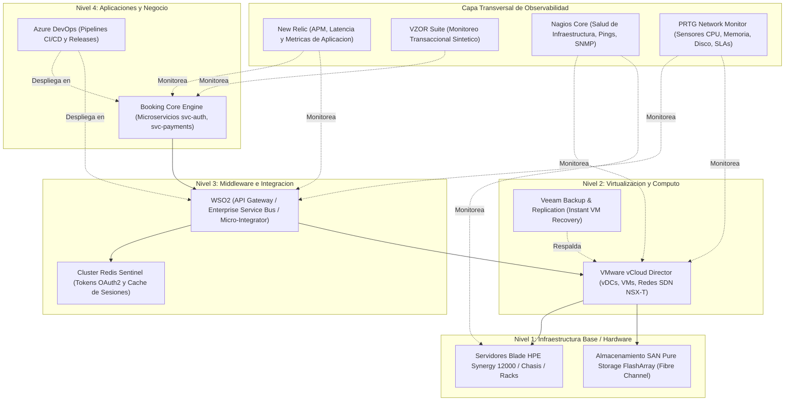

# Arquitectura y Especificacion Tecnica: Copilot de Infraestructura y RAG Documental

## 1. Vision General del Proyecto
Desarrollo de un asistente inteligente corporativo (**Copilot de Operaciones / AIOps**) disenado para:
1. **Unificar la documentacion tecnica:** Ingesta, indexacion y busqueda full-text en manuales, procedimientos operativos, PDFs complejos y documentos ofimaticos (Word, Excel, PowerPoint, Markdown).
2. **Consultas analiticas de inventario y mantenimientos:** Busqueda exacta y en tiempo real de historiales de servidores por fecha, numero de serie, tecnico, direccion IP, criticidad y componentes mediante DuckDB y datos tabulares normalizados.
3. **Mapeo de arquitectura en 4 niveles:** Comprension jerarquica y causal de dependencias entre hardware fisico, virtualizacion, middleware y aplicaciones de negocio.
4. **Integracion con observabilidad y SLAs:** Evaluacion y correlacion de metricas de monitoreo (*Nagios, PRTG, VZOR, New Relic, vCloud Director, Azure DevOps*), tiempos de respuesta y matrices de escalamiento 7x24.
5. **Ingesta y conversion masiva por lotes:** Procesamiento paralelo multihilo con control de inmutabilidad y firmas criptograficas SHA-256.
6. **Interfaz corporativa Theme-Safe:** Diseno visual nativo adaptativo 100% compatible con Tema Claro (*Light*) y Tema Oscuro (*Dark*).

---

## 2. Mapeo de Arquitectura en 4 Niveles

El sistema comprende la infraestructura jerarquicamente para realizar analisis de impacto y diagnosticos de causa raiz (*Root Cause Analysis*):



---

### 3. Pipeline de Ingesta y Procesamiento Documental

```text
[ Fuentes de Entrada ]
       │
       ├── Documentos Ofimaticos (.docx, .pptx, .pdf, .txt, .md) ──► MarkItDown Engine
       ├── Libros Excel y CMDBs Complejas (.xlsx, .xls) ─────────► excel_cleaner.py (Multihoja)
       ├── Fichas Tecnicas y Matrices de Monitoreo PRTG ─────────► Extraccion Estructurada
       └── Excels de Mantenimiento e Inventario ─────────────────► CSV Normalizado (DuckDB)
                                                                           │
                                                                           ▼
                                                             [ Pipeline de Ingesta Masiva ]
                                                             - Multi-hilo (ThreadPoolExecutor)
                                                             - Manifiesto Inmutable (SHA-256)
                                                             - Enmascaramiento de Credenciales
```

### Componentes de Ingesta
* **Procesador Excel Limpio (`excel_cleaner.py`):** Parser y extractor que preserva encabezados, omite ruido estructural y segmenta libros complejos por hojas individuales (`## Hoja: ...`).
* **MarkItDown (Microsoft):** Motor multiformato para conversion de Word (`mammoth`), Excel (`openpyxl`), PDF (`pypdf`), PowerPoint (`python-pptx`) y Markdown.
* **Worker de Ingesta Masiva (`batch_ingest.py`):** Script para conversion por lotes en paralelo con deteccion automatica de cambios mediante firmas SHA-256 registradas en `data/ingestion_manifest.json`.
* **Fichas Tecnicas Complejas de Servidores:** Estandarizacion de matrices de celdas combinadas con datos de monitoreo PRTG (sensores de CPU, Memoria, PING, Disco, HTTP), umbrales (Warning/Critical), criticidad de ambiente y matrices de escalamiento (ej. `BALANCER001`).

---

## 4. Motor de Busqueda Dual

Para resolver el punto ciego de los RAGs vectoriales tradicionales al procesar inventarios y datos tabulares exactos:

| Tipo de Consulta | Motor Implementado | Caso de Uso |
| :--- | :--- | :--- |
| **Busqueda Exacta / Analitica** | **DuckDB (en memoria)** | Consultas por numero de serie (`SN-8842-A`), direccion IP (`10.24.0.125`), identificador de servidor (`BALANCER001`), conteos por nivel, filtrado SQL y diagnostico de SLAs. |
| **Busqueda Contextual / Documental** | **MarkItDown + Full-Text Fragment Engine** | Procedimientos de rollback, manuales de contingencia de WSO2, guias de recuperacion de Veeam, reportes postmortem P1, CMDBs y politicas de seguridad con navegacion por fragmentos y lineas. |

---

## 5. Estructura del Proyecto

```text
Prototipo/
├── app.py                             # Aplicacion interactiva Streamlit (5 Tabs: Chat, Analitica, Topologia, Docs, Plantillas)
├── batch_ingest.py                    # Worker de conversion masiva multihilo con cache SHA-256
├── excel_cleaner.py                   # Motor de extraccion y limpieza de CMDBs y libros Excel
├── requirements.txt                   # Dependencias del entorno virtual (DuckDB, Pandas, MarkItDown, Google-GenAI)
├── run_app.bat                        # Lanzador de ejecucion en Windows (Batch)
├── run_app.ps1                        # Lanzador de ejecucion en Windows (PowerShell)
├── README.md                          # Manual de uso e instrucciones del sistema
├── ARQUITECTURA_COPILOT_INFRAESTRUCTURA.md # Especificacion tecnica y documentacion de arquitectura
├── HOJA_DE_RUTA_DIAGRAMAS_E_INGESTA.md     # Planificacion de diagramas, OCR y sincronizacion de red
├── GEMINI.md                          # Reglas y directrices de desarrollo para el asistente
└── data/
    ├── mantenimientos.csv             # Base estructurada de inventario y mantenimientos
    ├── ingestion_manifest.json        # Manifiesto de firmas SHA-256 de archivos procesados
    ├── audit_log.json                 # Registro centralizado de auditoria y trazabilidad global
    ├── inbox/                         # Carpeta de entrada para ingesta masiva desatendida
    ├── history/                       # Repositorio inmutable de snapshots versionados (v1, v2...)
    └── docs/                          # Repositorio de documentacion tecnica indexada
        ├── ficha_tecnica_BALANCER001.md
        ├── datacenter_chasis_blade_hpe.md
        ├── almacenamiento_san_purestorage.md
        ├── vmware_vcloud_redes_nsx.md
        ├── politicas_backup_veeam.md
        ├── wso2_tuning_optimizacion_threads.md
        ├── redis_cluster_cache_failover.md
        ├── booking_engine_arquitectura_servicios.md
        ├── incident_management_postmortem_p1.md
        ├── matriz_alertamiento_nagios_newrelic.md
        ├── politicas_seguridad_auditoria_devops.md
        ├── manual_contingencia_wso2.md
        └── procedimiento_rollback_booking.md
```

---

## 6. Modos de Operacion y Ejecucion

### 6.1 Inicio del Servidor Web
* **Mediante script de un clic:** Ejecutar `run_app.bat` o `run_app.ps1`.
* **Mediante terminal:**
  ```powershell
  .\.venv\Scripts\streamlit run app.py
  ```
* **Acceso Local:** `http://localhost:8501`

### 6.2 Procesamiento Masivo Desatendido
Para convertir volumenes grandes de documentos en la carpeta `data/inbox/`:
```powershell
.\.venv\Scripts\python batch_ingest.py
```

---

## 7. Proyectos y Ecosistema de Referencia en la Industria

| Proyecto / Framework | Organizacion | Relevancia y Comparacion |
| :--- | :--- | :--- |
| **HolmesGPT** | [`robusta-dev/holmesgpt`](https://github.com/robusta-dev/holmesgpt) | Asistente de investigacion de incidentes y observabilidad AIOps con LLMs. |
| **Keep** | [`keephq/keep`](https://github.com/keephq/keep) | Plataforma de correlacion y gestion de alertas multimonitor (Nagios, New Relic, Datadog). |
| **K8sGPT** | [`k8sgpt-ai/k8sgpt`](https://github.com/k8sgpt-ai/k8sgpt) | Diagnostico automatizado de infraestructura y analisis de causa raiz. |
| **MarkItDown** | [`microsoft/markitdown`](https://github.com/microsoft/markitdown) | Motor de conversion de formatos ofimaticos a Markdown para LLMs. |
| **Docling** | [`DS4SD/docling`](https://github.com/DS4SD/docling) | Parsing de documentos con celdas y tablas complejas mediante IA visual. |
| **GraphRAG** | [`microsoft/graphrag`](https://github.com/microsoft/graphrag) | RAG estructurado en grafos de conocimiento y relaciones jerarquicas topologicas. |
| **Vanna.ai** | [`vanna-ai/vanna`](https://github.com/vanna-ai/vanna) | Consultas SQL sobre datos analiticos tabulares en lenguaje natural. |
| **Data-Copilot** | [`zwq2018/Data-Copilot`](https://github.com/zwq2018/Data-Copilot) | Agente autonomo para gestion y visualizacion de datos heterogeneos (ICLR 2024). |

---

## 8. Consideraciones de Seguridad y Buenas Practicas

1. **Operacion Autonoma Local (Air-Gapped Ready):** Capacidad de operar 100% desconectado de nubes publicas utilizando DuckDB y busqueda local sin requerir envio de datos a proveedores externos.
2. **Inmutabilidad de Registros (*Append-Only*):** Los historiales y firmas de documentos no se sobreescriben; se registran con hashes SHA-256 para auditoria y copias históricas en `data/history/`.
3. **Modo Solo Lectura (*Read-Only by Default*):** El asistente sugiere diagnósticos, comandos y runbooks sin ejecutar modificaciones directas en produccion sin aprobacion humana (*Human-in-the-Loop*).
4. **Compatibilidad Visual Total:** Diseno libre de dependencias de tema rigidas, adaptandose dinamicamente a la configuracion del usuario (Light/Dark).
5. **Politica Estricta Sin Emojis:** Prohibicion total del uso de emojis en interfaces, botones, mensajes del sistema, codigo y respuestas del asistente, priorizando un estilo sobrio, formal y corporativo con etiquetas textuales estructuradas (`[OK]`, `[WARN]`, `[CRIT]`, etc.).
6. **Auditoria Obligatoria de Cambios y Reversiones:** Exigencia estricta de registro del Editor Responsable y la Justificacion Tecnica en cualquier modificacion o Rollback, consolidando la trazabilidad en `data/audit_log.json`.