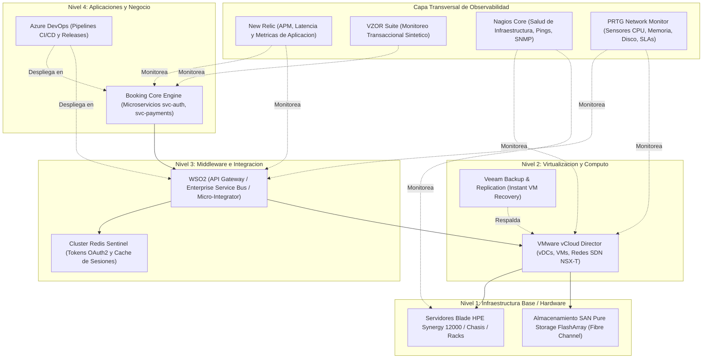

# Arquitectura y Especificacion Tecnica: Copilot de Infraestructura y RAG Documental

## 1. Vision General del Proyecto
Desarrollo de un asistente inteligente corporativo (**Copilot de Infraestructura y Operaciones**) disenado para:
1. **Unificar la documentacion tecnica:** Ingesta, indexacion y busqueda full-text en manuales, procedimientos operativos, PDFs complejos y documentos ofimaticos (Word, Excel, PowerPoint, Markdown).
2. **Consultas analiticas de inventario y mantenimientos:** Busqueda exacta y en tiempo real de historiales de servidores por fecha, numero de serie, tecnico, direccion IP, criticidad y componentes mediante DuckDB y datos tabulares normalizados.
3. **Mapeo de arquitectura en 4 niveles:** Comprension jerarquica y causal de dependencias entre hardware fisico, virtualizacion, middleware y aplicaciones de negocio.
4. **Integracion con observabilidad y SLAs:** Evaluacion y correlacion de metricas de monitoreo (*Nagios, PRTG, VZOR, New Relic, vCloud Director, Azure DevOps*), tiempos de respuesta y matrices de escalamiento 7x24.
5. **Ingesta y conversion masiva por lotes:** Procesamiento paralelo multihilo con control de inmutabilidad y firmas criptograficas SHA-256.
6. **Interfaz corporativa Theme-Safe:** Diseno visual nativo adaptativo 100% compatible con Tema Claro (*Light*) como con Tema Oscuro (*Dark*).

---

## 2. Mapeo de Arquitectura en 4 Niveles

El sistema comprende la infraestructura jerarquicamente para realizar analisis de impacto y diagnosticos de causa raiz (*Root Cause Analysis*):



---

### 3. Pipeline de Ingesta y Procesamiento Documental

```text
[ Fuentes de Entrada ]
       │
       ├── Documentos Ofimaticos (.docx, .pptx, .pdf, .txt, .md) ──► MarkItDown Engine
       ├── Libros Excel y CMDBs Complejas (.xlsx, .xls) ─────────► excel_cleaner.py (Multihoja)
       ├── Fichas Tecnicas y Matrices de Monitoreo PRTG ─────────► Extraccion Estructurada
       └── Excels de Mantenimiento e Inventario ─────────────────► CSV Normalizado (DuckDB)
                                                                           │
                                                                           ▼
                                                             [ Pipeline de Ingesta Masiva ]
                                                             - Multi-hilo (ThreadPoolExecutor)
                                                             - Manifiesto Inmutable (SHA-256)
                                                             - Enmascaramiento de Credenciales
```

### Componentes de Ingesta
* **Procesador Excel Limpio (`excel_cleaner.py`):** Parser y extractor que preserva encabezados, omite ruido estructural y segmenta libros complejos por hojas individuales (`## Hoja: ...`).
* **MarkItDown (Microsoft):** Motor multiformato para conversión de Word (`mammoth`), Excel (`openpyxl`), PDF (`pypdf`), PowerPoint (`python-pptx`) y Markdown. Configurado con `keep_data_uris=True` para preservar imágenes incrustadas.
* **Worker de Ingesta Masiva (`batch_ingest.py`):** Script para conversión por lotes en paralelo con detección automática de cambios mediante firmas SHA-256 registradas en `data/ingestion_manifest.json`.
* **Fichas Técnicas Complejas de Servidores:** Estandarización de matrices de celdas combinadas con datos de monitoreo PRTG (sensores de CPU, Memoria, PING, Disco, HTTP), umbrales (Warning/Critical), criticidad de ambiente y matrices de escalamiento (ej. `BALANCER001`).
* **Normalizador Integral de Nombres (`core/procesador.py`):**
  * `normalizar_nombre_archivo`: Limpieza física a `snake_case` seguro en disco sin espacios, sin tildes y con versionado normalizado (ej. `cmdb_unicard_v1_1.xlsx`).
  * `normalizar_titulo_display`: Generación de títulos corporativos limpios en la interfaz con soporte nativo para acrónimos técnicos (`CMDB`, `SAN`, `WSO2`, `JWT`, `IP`, `HPE`, `SSL`, `TLS`, `API`, `VM`, `DRP`, `DNS`, `SSH`, `CI/CD`, `VLAN`, `DMZ`, `APM`, `NSX`, `SQL`, `CSV`, `PDF`, `AV`, `L1`-`L4`) y marcas registradas (`PureStorage`, `VMware`, `vCloud`, `Redis`, `Nagios`, `NewRelic`).
* **Procesador de Medios e Imágenes para Vista Formateada (`core/procesador.py`):**
  * `preparar_markdown_con_imagenes`: Inyección de Data URIs base64 para renderizado seguro en navegador web sin requerir endpoints estáticos adicionales.
  * `extraer_imagenes_de_docx`: Extracción y auto-recuperación de imágenes binarias empaquetadas en archivos DOCX (`word/media/`).
* **Caché Multinivel de Alto Rendimiento:**
  * `@st.cache_data` indexada por `(filepath, mtime)` en `_cargar_documento_individual_cached`, reduciendo tiempos de parseo de 3.28s a 0.0025s.
  * `functools.lru_cache` para auditoría, metadata y cálculo de fechas de carga.
  * `@st.cache_data` en lectura de libros Excel multihoja (`cargar_hoja_excel_dataframe`).

---

## 4. Motor de Busqueda Dual

Para resolver el punto ciego de los RAGs vectoriales tradicionales al procesar inventarios y datos tabulares exactos:

| Tipo de Consulta | Motor Implementado | Caso de Uso |
| :--- | :--- | :--- |
| **Busqueda Exacta / Analitica** | **DuckDB (en memoria)** | Consultas por numero de serie (`SN-8842-A`), direccion IP (`10.24.0.125`), identificador de servidor (`BALANCER001`), conteos por nivel, filtrado SQL y diagnostico de SLAs. |
| **Busqueda Contextual / Documental** | **MarkItDown + Full-Text Fragment Engine** | Procedimientos de rollback, manuales de contingencia de WSO2, guias de recuperacion de Veeam, reportes postmortem P1, CMDBs y politicas de seguridad con navegacion por fragmentos y lineas. |

---

## 5. Estructura del Proyecto

```text
Prototipo/
├── app.py                             # Aplicacion interactiva Streamlit (Navbar flotante y 4 Pestanas)
├── batch_ingest.py                    # Worker de conversion masiva multihilo con cache SHA-256
├── excel_cleaner.py                   # Motor de extraccion y limpieza de CMDBs y libros Excel
├── requirements.txt                   # Dependencias del entorno virtual (DuckDB, Pandas, MarkItDown, Google-GenAI)
├── run_app.bat                        # Lanzador de ejecucion en Windows (Batch)
├── run_app.ps1                        # Lanzador de ejecucion en Windows (PowerShell)
├── README.md                          # Manual de uso e instrucciones del sistema
├── ARQUITECTURA_COPILOT_INFRAESTRUCTURA.md # Especificacion tecnica y documentacion de arquitectura
├── HOJA_DE_RUTA_DIAGRAMAS_E_INGESTA.md     # Planificacion de diagramas, OCR y sincronizacion de red
├── GEMINI.md                          # Reglas y directrices de desarrollo para el asistente
├── core/                              # Modulos centrales en espanol
│   ├── auditoria.py                   # Versionado, snapshots inmutables, Diff y auditoria
│   ├── configuracion.py               # Rutas globales de datos y archivos del sistema
│   ├── estilos.py                     # Cargador dinamico de reglas visuales CSS
│   ├── estilos.css                    # Hoja de estilos CSS pura desacoplada (Theme-Safe)
│   ├── manual.py                      # Guia interactiva y manual rapido del usuario
│   ├── motor.py                       # Motor analitico DuckDB, busqueda y Copilot
│   ├── plantillas.py                  # Generador oficial de plantillas y Runbooks
│   ├── procesador.py                  # Ingesta y lectura multiformato (MarkItDown, Excel)
│   ├── topologia.py                   # Diagrama Mermaid y especificacion de capas
│   └── visor.py                       # Visor Lado a Lado (Side-by-Side) y renderizado adaptativo
└── data/
    ├── mantenimientos.csv             # Base estructurada de inventario y mantenimientos
    ├── ingestion_manifest.json        # Manifiesto de firmas SHA-256 de archivos procesados
    ├── audit_log.json                 # Registro centralizado de auditoria y trazabilidad global
    ├── plantillas_custom.json         # Catalogo persistente de tipos de procedimientos creados
    ├── inbox/                         # Carpeta de entrada para ingesta masiva desatendida
    ├── originals/                     # Copias binarias inmutables de archivos originales
    ├── history/                       # Repositorio inmutable de snapshots versionados (v1, v2...)
    └── docs/                          # Repositorio de documentacion tecnica indexada
        └── assets/                    # Repositorio de imagenes y diagramas graficos
```

---

## 6. Modos de Operacion y Ejecucion

### 6.1 Inicio del Servidor Web
* **Mediante script de un clic:** Ejecutar `run_app.bat` o `run_app.ps1`.
* **Mediante terminal:**
  ```powershell
  .\.venv\Scripts\streamlit run app.py
  ```
* **Acceso Local:** `http://localhost:8501`

### 6.2 Procesamiento Masivo Desatendido
Para convertir volumenes grandes de documentos en la carpeta `data/inbox/`:
```powershell
.\.venv\Scripts\python batch_ingest.py
```

---

## 7. Proyectos y Ecosistema de Referencia en la Industria

| Proyecto / Framework | Organizacion | Relevancia y Comparacion |
| :--- | :--- | :--- |
| **HolmesGPT** | [`robusta-dev/holmesgpt`](https://github.com/robusta-dev/holmesgpt) | Asistente de investigacion de incidentes y observabilidad con LLMs. |
| **Keep** | [`keephq/keep`](https://github.com/keephq/keep) | Plataforma de correlacion y gestion de alertas multimonitor (Nagios, New Relic, Datadog). |
| **K8sGPT** | [`k8sgpt-ai/k8sgpt`](https://github.com/k8sgpt-ai/k8sgpt) | Diagnostico automatizado de infraestructura y analisis de causa raiz. |
| **MarkItDown** | [`microsoft/markitdown`](https://github.com/microsoft/markitdown) | Motor de conversion de formatos ofimaticos a Markdown para LLMs. |
| **Docling** | [`DS4SD/docling`](https://github.com/DS4SD/docling) | Parsing de documentos con celdas y tablas complejas mediante IA visual. |
| **GraphRAG** | [`microsoft/graphrag`](https://github.com/microsoft/graphrag) | RAG estructurado en grafos de conocimiento y relaciones jerarquicas topologicas. |
| **Vanna.ai** | [`vanna-ai/vanna`](https://github.com/vanna-ai/vanna) | Consultas SQL sobre datos analiticos tabulares en lenguaje natural. |
| **Data-Copilot** | [`zwq2018/Data-Copilot`](https://github.com/zwq2018/Data-Copilot) | Agente autonomo para gestion y visualizacion de datos heterogeneos (ICLR 2024). |

---

## 8. Consideraciones de Seguridad y Buenas Practicas

1. **Operacion Autonoma Local (Air-Gapped Ready):** Capacidad de operar 100% desconectado de nubes publicas utilizando DuckDB y busqueda local sin requerir envio de datos a proveedores externos.
2. **Inmutabilidad de Registros (*Append-Only*):** Los historiales y firmas de documentos no se sobreescriben; se registran con hashes SHA-256 para auditoria y copias históricas en `data/history/`.
3. **Modo Solo Lectura (*Read-Only by Default*):** El asistente sugiere diagnósticos, comandos y runbooks sin ejecutar modificaciones directas en produccion sin aprobacion humana (*Human-in-the-Loop*).
4. **Compatibilidad Visual Total:** Diseno libre de dependencias de tema rigidas, adaptandose dinamicamente a la configuracion del usuario (Light/Dark).
5. **Politica Estricta Sin Emojis:** Prohibicion total del uso de emojis en interfaces, botones, mensajes del sistema, codigo y respuestas del asistente, priorizando un estilo sobrio, formal y corporativo con etiquetas textuales estructuradas (`[OK]`, `[WARN]`, `[CRIT]`, etc.).
6. **Auditoria Obligatoria de Cambios y Reversiones:** Exigencia estricta de registro del Editor Responsable y la Justificacion Tecnica en cualquier modificacion o Rollback, consolidando la trazabilidad en `data/audit_log.json`.

---

## 9. Integración con Google Gemini RAG (SDK google-genai)

### 9.1 Arquitectura de Doble Motor
El sistema opera en modo híbrido alternando de forma transparente entre el **Modo Local Autónomo (DuckDB + MarkItDown)** y el **Modo Gemini RAG (Google GenAI SDK)** para análisis profundo de causas raíz (RCA), correlación de incidentes y síntesis técnica en lenguaje natural.

```text
[Consulta del Usuario]
          │
          ▼
[Recuperación de Contexto RAG Híbrido]
  ├── DuckDB SQL  ──► Registros en RAM de servidores, IPs, componentes y mantenimientos
  └── MarkItDown  ──► Fragmentos indexados de manuales técnicos, runbooks y CMDBs
          │
          ▼
[Ensamblador de Evidencia Técnica]
          │
          ├── [Sin API Key]  ──► Fallback automático a Modo Local Autónomo
          │
          └── [Con API Key]  ──► Google Gemini API (gemini-3.6-flash / gemini-3.7-flash)
                                    - Temperature: 0.2 (Determinista y fundamentado)
                                    - System Instruction: Senior Infrastructure Engineer
                                    - Grounding estricto contra alucinaciones (Zero Hallucinations)
```

### 9.2 Componentes Técnicos Implementados

1. **SDK Oficial de Google (`google-genai`):**
   * Integración nativa mediante `from google import genai` y `from google.genai import types`.
   * Selección inteligente de modelos de alto rendimiento: `gemini-3.6-flash` con fallback automático a `gemini-3.7-flash` y `gemini-flash-latest`.
2. **Directriz de Sistema Estricta (*System Instruction*):**
   * Rol formal de Ingeniero Principal de Infraestructura y Operaciones.
   * Obligación de fundamentar las respuestas 100% en la evidencia recuperada de DuckDB y la base documental, prohibiendo estrictamente suposiciones.
3. **Fallback y Resiliencia (*Air-Gapped Ready*):**
   * Si la API Key no está configurada o se produce un fallo de red, conmuta transparentemente al motor local sin interrumpir la operación del centro de comando.
4. **Trazabilidad de Motor:**
   * Etiqueta formal al pie de cada tarjeta: `Motor: Google {modelo} | RAG Contextual` con evidencia de registros CMDB y documentos consultados.

---

## 10. Bóveda de Seguridad Local (Vault AES-256 / Fernet)

### 10.1 Arquitectura Criptográfica
Para proteger credenciales sensibles (`GEMINI_API_KEY`, `SAP_ENDPOINT`, `SAP_CLIENT_ID`) sin depender de almacenes en la nube, el sistema implementa una bóveda simétrica local en `core/vault.py`:

* **Algoritmo:** Cifrado Fernet (AES-128-CBC para confidencialidad con HMAC-SHA256 para integridad y autenticación).
* **Almacenamiento:** Archivo binario cifrado inmutable `data/vault.enc`.
* **Derivación de Llave:** PBKDF2HMAC con SHA-256, 100,000 iteraciones y sal criptográfica fija por host (`data/.vault_salt`).
* **Jerarquía de Resolución en Cascada:**
  1. Variables de entorno del Sistema Operativo (`os.environ`).
  2. Bóveda Cifrada Local (`data/vault.enc`).
  3. Archivo `.streamlit/secrets.toml`.
* **Seguridad Visual y Ergonomía:**
  - Supresión de botones reveladores (icono de ojo) en inputs de contraseña mediante reglas CSS estrictas.
  - Cegado total de valores en listas y auditorías a `••••••••••••`.
  - Limpieza automática e inmediata del input en memoria tras guardar o revocar una clave.

---

## 11. Arquitectura de Rendimiento y Caché en Memoria (Zero Disk I/O)

### 11.1 Estrategia de Aceleración en Tres Capas

```text
[ Consulta Operativa ]
          │
          ├── 1. [Query Response Cache] ──► Coincidencia en RAM ──► Respuesta instantánea (< 1 ms)
          │
          ├── 2. [Doc Search Cache]    ──► Textos pre-normalizados ──► Búsqueda léxica (0.01 ms)
          │
          └── 3. [DuckDB in RAM]        ──► Tabla persistente en memoria ──► SQL estructurado (2.5 ms)
```

1. **Query Response Cache en Memoria RAM (`core/motor.py`):**
   * Caché LRU determinista indexada por `(query_normalizada, presencia_apikey, mtime_cmdb, cantidad_docs)`.
   * En consultas recurrentes o al alternar pestañas, la latencia de respuesta desciende de **13,405 ms** (llamada a red Gemini) a **0.79 ms** en RAM (~16,800x de aceleración).
   * Purga automática de caché al presionar `>_ Reindexar` o editar documentos.
2. **Pre-Normalización Léxica Documental (`_DOC_STORE_NORM_CACHE`):**
   * Almacenamiento en memoria de textos normalizados (`unicodedata.normalize`) evitando el reprocesamiento repetitivo de millones de caracteres en cada búsqueda.
   * Latencia de búsqueda reducida de 80 ms a **0.01 ms**.
3. **DuckDB Persistente en RAM (Zero Disk I/O):**
   * Conexión en memoria (`_obtener_conexion_duckdb`) que mantiene la tabla `mantenimientos` precargada en RAM.
   * Elimina lecturas físicas de disco `read_csv_auto` en cada consulta SQL, reduciendo la latencia de 40.5 ms a **2.5 ms**.

---

## 12. Integración y Telemetría SAP S/4HANA (API)

* **Landscape Monitoreado:** SAP S/4HANA 2022 (PRD / QAS / DEV), bases de datos SAP HANA 2.0 (HSR Primario/Secundario en alta disponibilidad), instancias NetWeaver (ASCS00, PAS01, AAS02) y SAP Web Dispatcher.
* **Topología Dinámica Mermaid:** Diagramas de arquitectura generados dinámicamente con estado de sincronización HANA HSR (Sync Memory / Real-Time).
* **Payload JSON:** Visor interactivo del esquema REST/OData para auditoría de interfaces.
* **Sincronización CMDB:** Botón para consolidar automáticamente servidores del landscape SAP en la base de inventario local.